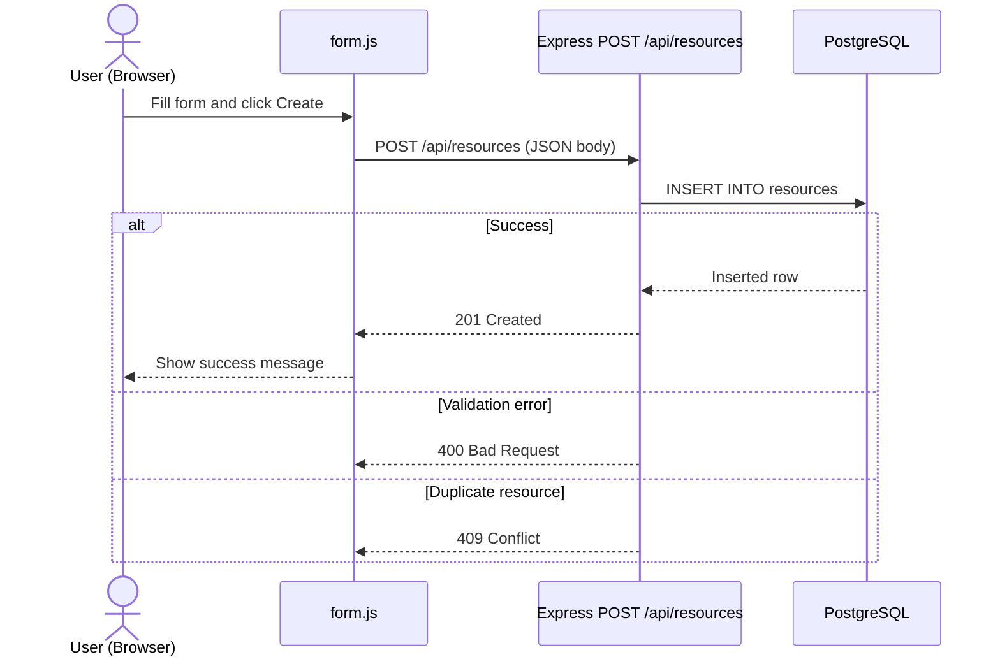
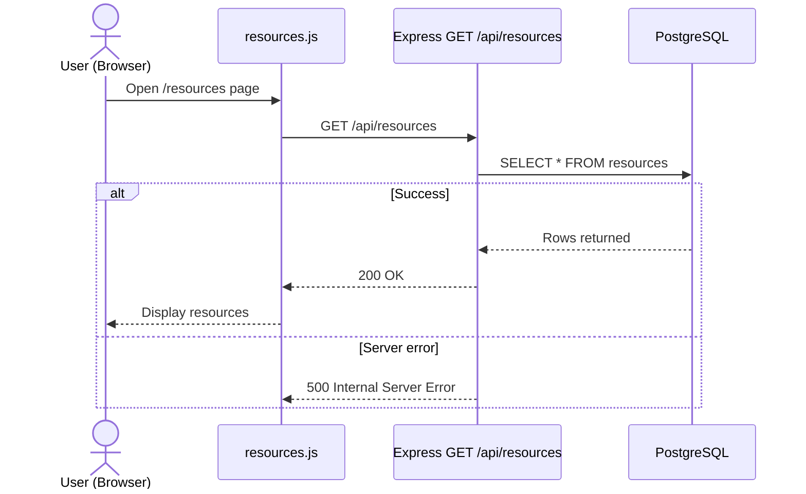
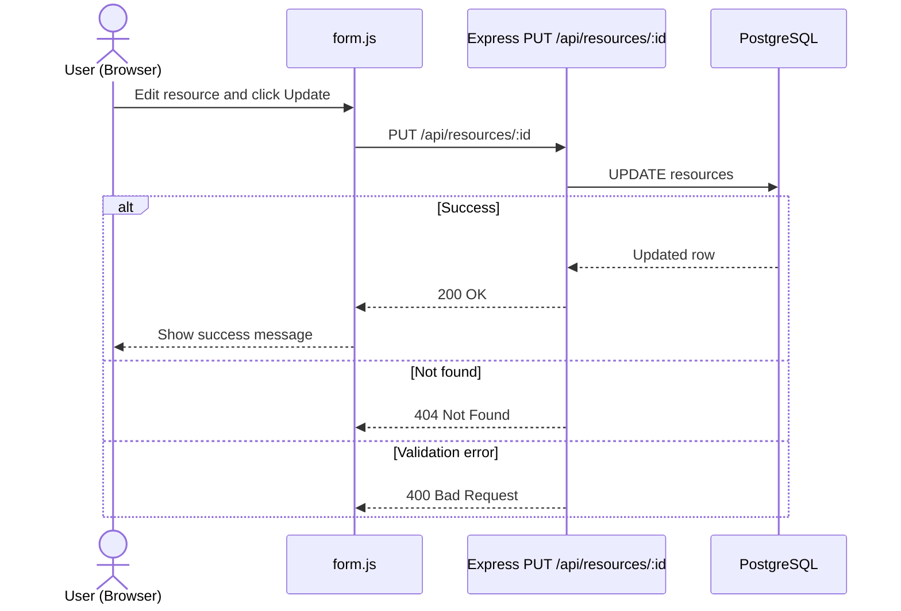
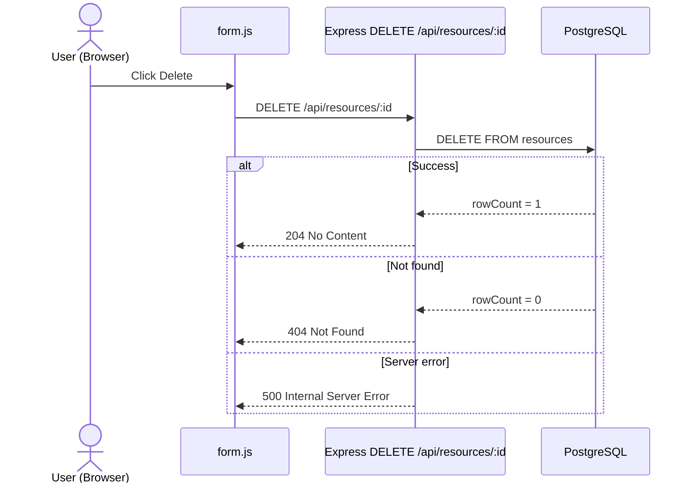

# G1 - CRUD Data Flow (Booking System Phase6)

This document describes CRUD operations based on actual behavior observed and verified using browser Developer Tools (Network tab) in Booking System Phase6.

---

## CREATE (C)

---

## READ (R)

---

## UPDATE (U)

---

## DELETE (D)

---

## Notes

- Verified using Chrome Developer Tools (Network tab)
- Observed endpoints:
  - GET → /api/resources → 200 OK
  - POST → /api/resources → 201 Created
  - PUT → /api/resources/:id → 200 OK
  - DELETE → /api/resources/:id → 204 No Content
